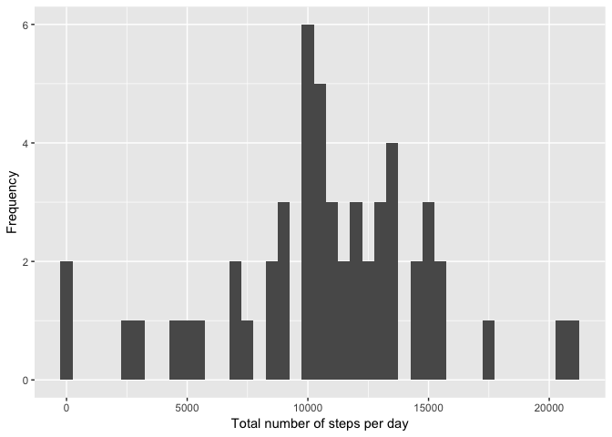
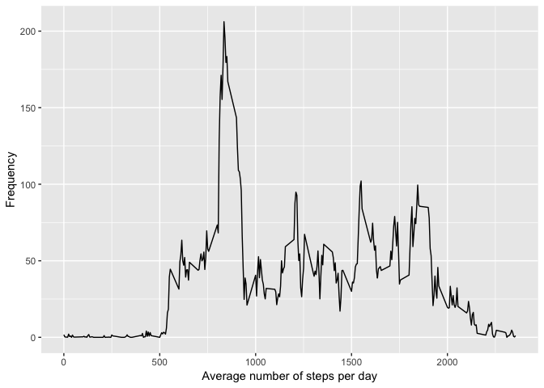
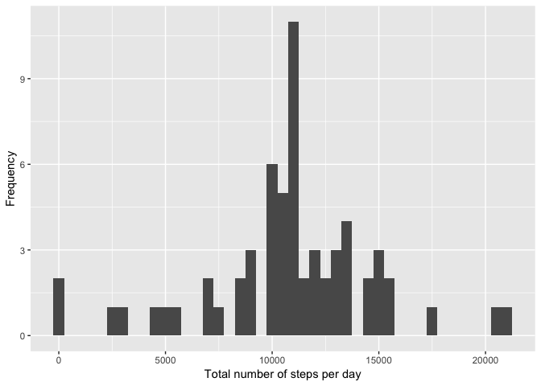
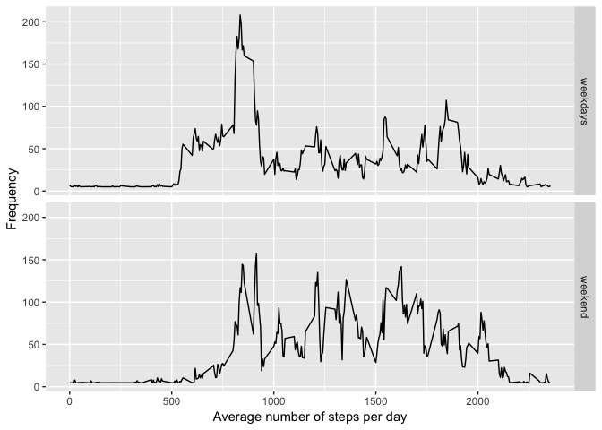

Activity monitoring data
------------------------

This assignment makes use of data from a personal activity monitoring device. This device collects data at 5 minute intervals through out the day. The data consists of two months of data from an anonymous individual collected during the months of October and November, 2012 and include the number of steps taken in 5 minute intervals each day.

``` r
activity <- read.csv("activity.csv")
summary(activity)
```

    ##      steps                date          interval     
    ##  Min.   :  0.00   2012-10-01:  288   Min.   :   0.0  
    ##  1st Qu.:  0.00   2012-10-02:  288   1st Qu.: 588.8  
    ##  Median :  0.00   2012-10-03:  288   Median :1177.5  
    ##  Mean   : 37.38   2012-10-04:  288   Mean   :1177.5  
    ##  3rd Qu.: 12.00   2012-10-05:  288   3rd Qu.:1766.2  
    ##  Max.   :806.00   2012-10-06:  288   Max.   :2355.0  
    ##  NA's   :2304     (Other)   :15840

Generated Plots
---------------

1.  Histogram of the total number of steps taken each day:



2.  Mean and median number of steps taken each day:

<!-- -->

    ## [1] 10766.19

    ## [1] 10765

3.  Time series plot of the average number of steps taken: 

4.  The 5-minute interval that, on average, contains the maximum number of steps:

<!-- -->

    ##     interval    steps
    ## 104      835 206.1698

5.  Code to describe and show a strategy for imputing missing data.
    Number of missing data in the steps column:

<!-- -->

    ## [1] 2304

Fill all of the missing values in the dataset.

``` r
## Mean for all days
mean(activity$steps, na.rm = T)
```

    ## [1] 37.3826

``` r
## Fill with mean value empty rows
act_imp <- activity
act_imp$steps[is.na(act_imp$steps)] <- mean(act_imp$steps, na.rm = T)
```

6.  Histogram of the total number of steps taken each day after missing values are imputed: 

Mean and median number of steps taken each day:

    ## [1] 10766.19

    ## [1] 10766.19

7.  Panel plot comparing the average number of steps taken per 5-minute interval across weekdays and weekends:

<!-- -->

    ##     steps       date interval    day    weeks
    ## 1 37.3826 2012-10-01        0 Monday weekdays
    ## 2 37.3826 2012-10-01        5 Monday weekdays
    ## 3 37.3826 2012-10-01       10 Monday weekdays
    ## 4 37.3826 2012-10-01       15 Monday weekdays
    ## 5 37.3826 2012-10-01       20 Monday weekdays
    ## 6 37.3826 2012-10-01       25 Monday weekdays


